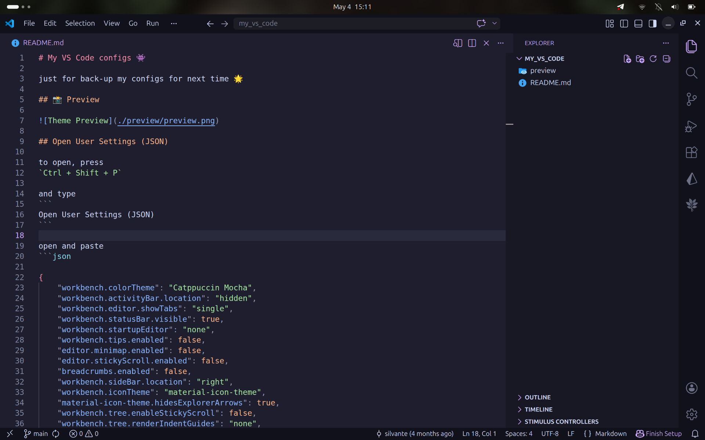

# My VS Code configs 👾

just for back-up my configs for next time 🌟

## 📸 Preview



## Open User Settings (JSON)

to open, press
`Ctrl + Shift + P`

and type
```
Open User Settings (JSON)
```

open and paste
```json

{
    "workbench.colorTheme": "Catppuccin Mocha",
    "workbench.activityBar.location": "hidden",
    "workbench.statusBar.visible": false,
    "workbench.editor.showTabs": "single",
    "workbench.startupEditor": "none",
    "workbench.tips.enabled": false,
    "editor.stickyScroll.enabled": false,
    "workbench.sideBar.location": "right",
    "workbench.iconTheme": "material-icon-theme",
    "material-icon-theme.hidesExplorerArrows": true,
    "workbench.tree.enableStickyScroll": false,
    "workbench.tree.renderIndentGuides": "none",
    "workbench.tree.indent": 12,
    "explorer.compactFolders": false,
    "window.zoomLevel": 1.5,
    "files.autoSave": "afterDelay",
    "editor.cursorStyle": "line",
    "editor.cursorBlinking": "expand",
    "workbench.preferredHighContrastColorTheme": "Julia (Monokai Vibrant)",
    "explorer.confirmDelete": false,
    "editor.fontLigatures": true,
    "editor.fontFamily": "JetBrainsMono Nerd Font",
    "editor.scrollbar.horizontal": "hidden",
    "editor.scrollbar.vertical": "hidden",
    "editor.minimap.enabled": false,
    "editor.hideCursorInOverviewRuler": true,
    "editor.overviewRulerBorder": false,
    "workbench.editor.enablePreview": false,
    "window.commandCenter": false,
    "window.menuBarVisibility": "compact",
    "workbench.layoutControl.enabled": false,
    "workbench.browser.showInTitleBar": true
}

```
save the changes

then press `Ctrl + Shift + X`

and download `Aura Dracula Spirit` color theme theme, and other (optional) packages

## that is it, happy building apps that matter ⚡️

🌴 [xamidov uz](https://xamidov.uz)
